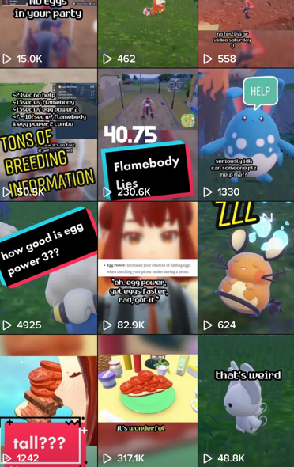

### musings of the first time I've been 'popular'

December I did something different. I made a video about pokemon breeding without my avatar or it being a clip from any of my vtuber stuff. The video itself was scuffed because I assumed no one would see it, and yet somehow it rocketed into 200k views. I know for some people that's not a lot at all, but for the better part of 10 years I've been playing around with putting things on the internet with the expectation that it's never going to get seen.

> For the most part, that's still true.

I decided to do a little bit more in video making, specifically for tiktok *(also reposted on youtube shorts if less than a minute)*. I continued on pokemon of course, but I structured my videos as informational. It turns out there's so much incorrect information floating around that general people just accept as true, to a stubborn degree. I got a lot of different responses, some thankful for the information, some not getting the point of the message and repeating *other* incorrect information, and other people astounded that people would believe these things.

I felt pretty overwhelmed at the response to each video. I can't imagine being someone who's **actually** *popular*, and sorting through the contents of thousands of comments. I know that most big creators say don't look at the comments, but how am I supposed to know how people feel about what I just did? It also helps me pick my next subject.

Unfortunately with my depression spike, it also affected my creation of videos even though it initially was happening as a distraction from other responsibilities. Knowing that there was an audience potentially waiting there for more videos with questions and thoughts started to feel like a responsibility in of itself.

So I'm in a little bit of an in-between spot where I have ideas and some footage for videos, but I can't bring myself to start editing it and compiling it. I dislike how quickly something that's joyful can start to feel like work. I definitely see how video creation can be a very daunting job. I never was the type to think *"oh they just get to play video games all day"* to start with, but I think it's a good reminder that all those people that make you free videos to watch actually have a lot of work to do.

